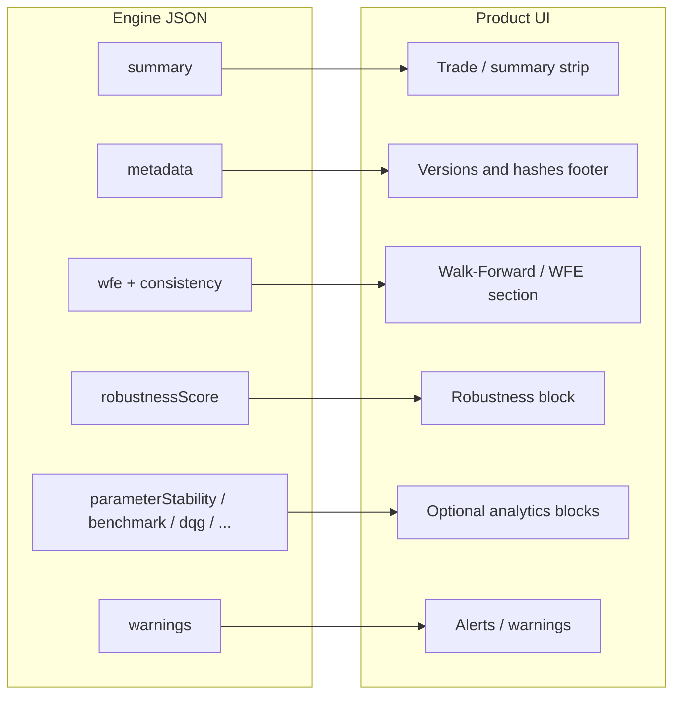

# Engine result shape and the Kiploks UI

The Open Core engine does **not** ship a web UI. It returns JSON (`AnalyzeOutput` or `WFAAnalysisOutput`). The hosted Kiploks product maps those fields into analysis pages (cards, tables, verdict blocks, and optional SSR slots).

## Minimal vs WFA

| Entry point | Contract | Typical use |
| ----------- | -------- | ----------- |
| `analyze()` | `AnalyzeOutput` | Quick trade statistics + reproducibility metadata |
| `analyzeFromTrades()` / `analyzeFromWindows()` | `WFAAnalysisOutput` | WFE, consistency, robustness score, optional blocks, warnings |

## Field to UI (conceptual)

- A **hosting application** may attach additional server-side blocks (benchmark comparison, final verdict payload, DQG details, etc.). Public WFA often exposes `available: false` with a **reason** for blocks that need a richer payload.
- **Single source of truth** for displayed verdicts and heavy analytics in a hosted deployment is the **server-assembled** analysis object; the OSS engine focuses on deterministic math and stable contracts.

## Static demo

Open [`result-layout-demo.html`](result-layout-demo.html) in a browser for a side-by-side schematic (conceptual blocks vs raw JSON).

Example files [`sample-output/`](sample-output/).

For benchmark, risk, kill switch, and other **full-report** blocks vs public WFA placeholders, see [`09-full-report-vs-public-wfa.md`](09-full-report-vs-public-wfa.md).
